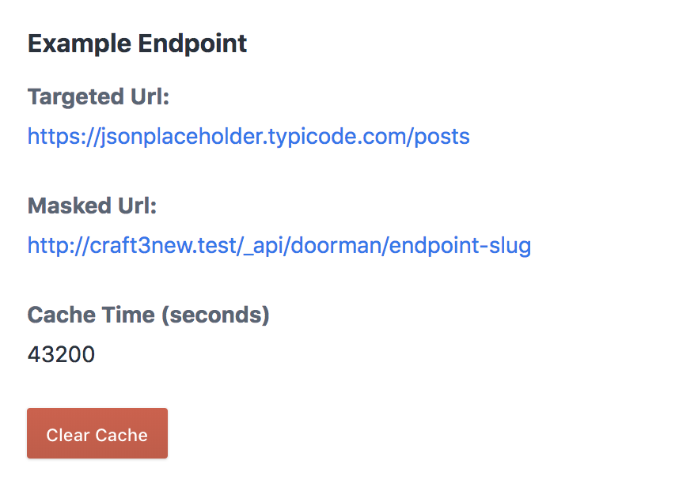

# Doorman

Sometime you will need to access a third party url, if you have either of the following requirement then this plugin might be able to help you:

- You want to hide the original url from the website user
- You don't want to hit the original url too often and prefer the content being cached

It helps to mask the original url, cache the result and serve it from a new url.

## Requirements

This plugin requires Craft CMS 3.0.0-beta.23 or later.

## Installation

To install the plugin, follow these instructions.

1. Open your terminal and go to your Craft project:

        cd /path/to/project

2. Then tell Composer to load the plugin:

        composer require simple-integrated-marketing/doorman

3. In the Control Panel, go to Settings → Plugins and click the “Install” button for Doorman.

## Configuring Doorman

You can config Doorman via the `doorman.php` under the `/config` folder

## Using Doorman

Doorman can be access via Admin CP ➡️ Utilities ➡️ Doorman 

## Doorman Roadmap

Feel free to submit any additional request.

Brought to you by [Simple Integrated Marketing](https://simple.com.au)
